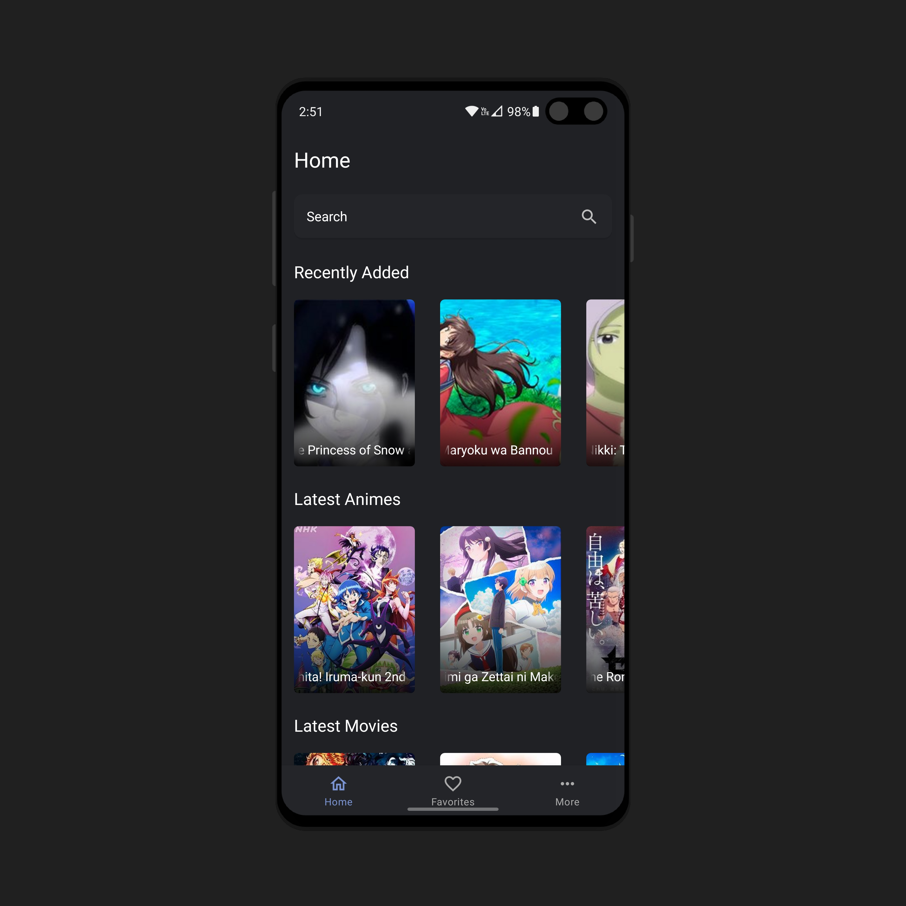
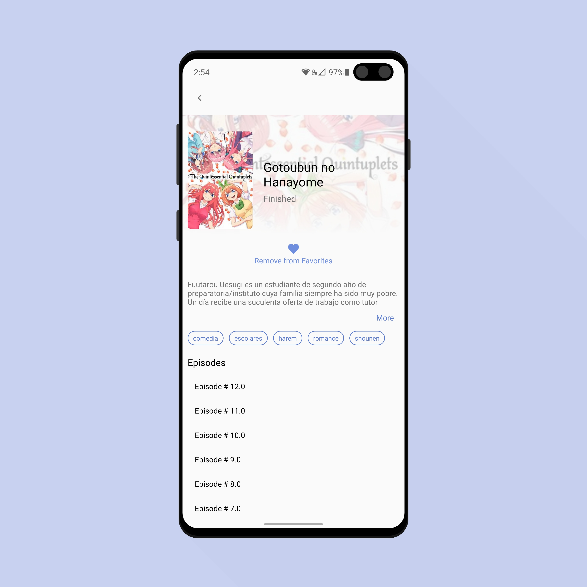
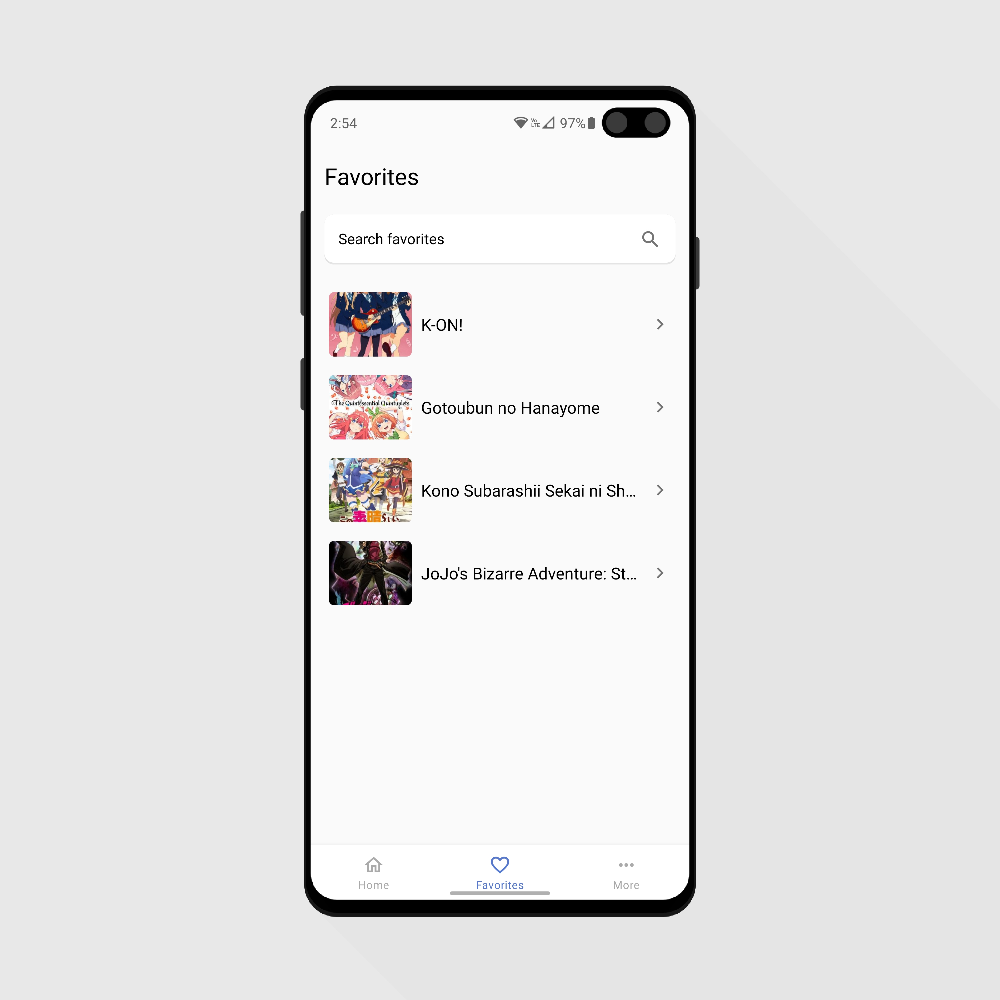

<!--
*** Thanks for checking out this README Template. If you have a suggestion that would
*** make this better, please fork the repo and create a pull request or simply open
*** an issue with the tag "enhancement".
*** Thanks again! Now go create something AMAZING! :D
-->

<!-- PROJECT SHIELDS -->
<!--
*** I'm using markdown "reference style" links for readability.
*** Reference links are enclosed in brackets [ ] instead of parentheses ( ).
*** See the bottom of this document for the declaration of the reference variables
*** for contributors-url, forks-url, etc. This is an optional, concise syntax you may use.
*** https://www.markdownguide.org/basic-syntax/#reference-style-links
-->

<!-- PROJECT LOGO -->
<br />
<p align="center">
    

  <h1 align="center">Akiyama</h1>

  <h2 align="center">
    An open source website and android app to watch anime
    <br />
  </h2>
</p>

<p align="center">
    
  
</p>
<p align="center">
   
    
</p>

<!-- ABOUT THE PROJECT -->

## About The Project

Akiyama is an open source website and android app to watch anime using the unofficial [AnimeFLV API](https://github.com/Jeluchu/animeflv), developed with the objective of learning and improving my coding skills

All the content that can be found in this application is hosted in third party servers such as Mega, YourUpload, FEMBED, etc. All this services are available for free online. For any legal trouble, related to the content shown in this website, must be addressed with the owners of the servers that are storing this content, as we are not affilliated nor colaborating with them.

### Built With

Web App:

- Angular
- Angular Material

Android App:

- Kotlin
- MVVM architecture

<!-- GETTING STARTED -->

## Getting Started

Before cloning the repo make sure you have installed

- [**NODE**](https://www.google.com/search?q=how+to+install+node) (version >= 12.17.x)
- [**NPM**](https://www.google.com/search?q=how+to+install+npm) (version >= 6.14.x)
- [**Android Studio**](https://developer.android.com/studio)

## Starting a local development server

- Once you have forked or downloaded the project, go into de server directory and install the server dependencies with

```
  npm install
```

- Then you can start the server with

```
  npm run build && npm run start
```

## Note

- By default the android project is configured to run in an emulator, so the API url is 10.0.2.2:4000 which is the equivalent to localhost:4000, if you want to debug the app in a physical device make sure to look inside the file mobile_app/app/build.gradle, then look into the buildTypes and change the url in buildConfigField inside debug to your local ip address.

## Contribution

1. Fork it!
2. Create a branch for the feature you want to make: `git checkout -b my-new-feature`
3. Commit changes: `git commit -am 'Add some feature'`
4. Push to the branch: `git commit -am 'Add some feature'`
5. Submit a pull request

**Note** both the angular and the android projects have environment variables to connect to your local Aruppi Api server. For default
the android app will connect to your local server only if you are running it on an emulator, if you want to test on a real device, change the variable
in the gradle file, but please don´t commit this change.

<!-- CONTACT -->

## Contact

Fernando Maldonado - [@Fmaldonado4202](https://twitter.com/Fmaldonado4202) - fmaldonado824@gmail.com

Project Link: [https://github.com/Fmaldonado6/Akiyama](https://github.com/Fmaldonado6/Akiyama)
