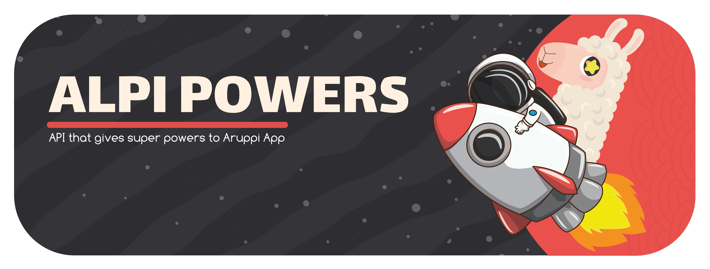

# **Aruppi API** (v3.1.2)

> This API has everything about Japan, from anime, music, radio, images, videos ... to japanese culture 
>
> These are the services used for the Aruppi App (only available in Spanish language)


---



## 📖 API Documentation
Soon we will add the documentation information in a link

## :rocket: Custom Aruppi API Link
Link to access the [Aruppi API](https://aruppi-api.jeluchu.now.sh/api/v2)

## 📚 **Development Diary**
Describe the purpose of the project and give clues about what the code does. 
For more information go to the following link [Diary Reference](./development_diary/README.md).

## **:wrench: Developer usage**

### **Set up project**

Before cloning the repo **be sure** you have installed:

- [**NODE**](https://www.google.com/search?q=how+to+install+node) (version >= 12.17.x)
- [**NPM**](https://www.google.com/search?q=how+to+install+npm) (version >= 6.14.x)

Then:

- Choose a folder project in your system and switch in `cd [folder path]`
- Clone the repo in your folder path `git clone https://github.com/aruppi/aruppi-api`

---

### **Installation**

In order to install the project and all dependencies, enter in the project folder and run `npm install`

---

### Start the project

```bash
npm start
```

### Test the project

```bash
npm test
```

---

## Deprecated v1 for API
Aruppi has grown since it was launched and we need to continue improving the application along with the services to be able to give new features.

But if you need to see the code or the operation of the old version you can do it

- [Aruppi API GitHub (v1) [Deprecated]](https://github.com/aruppi/aruppi-api-v1)
- [Aruppi API Custom Link(v1) [Deprecated]](https://aruppi.herokuapp.com/api/Aruppi/)

## Countdown to deprecation of v2 API

Aruppi has grown since it was launched and we need to continue improving the application along with the services to be able to give new features.

At this time version 2.6.8 will remain functional until Aruppi App users fully migrate to version 1.5.0 of the app

## **:handshake: Contributing**

- Fork it!
- Create your feature branch: `git checkout -b my-new-feature`
- Commit your changes: `git commit -am 'Add some feature'`
- Push to the branch: `git push origin my-new-feature`
- Submit a pull request

---

### **:busts_in_silhouette: Credits**

- [Darkangeel](https://github.com/Darkangeel-hd) (System administration authority (SYSADM))
- [Jéluchu](https://github.com/Jeluchu) (Android Developer, designer, and others)

---

### **:heart: Show your support**

Please :star: this repository if you like it or this project helped you!\
Feel free to open issues or submit pull-requests to help me improving my work.


---

### **📚 Projects that use the API**

<table>
  <tr>
    <td align="center">
      <a href="https://aruppi.jeluchu.com/">
        <br />
          <sub>
            <b>Aruppi</b>
          </sub>
      </a><br/>
        <sub>Anime y Manga</sub>
      </a>
    </td>
  </tr>
</table>


### **:robot: Author**

_*Jéluchu*_

> You can follow me on
[github](https://github.com/Jeluchu)&nbsp;&middot;&nbsp;[twitter](https://twitter.com/Jeluchu)

---

Copyright © 2020 [Jéluchu](https://about.jeluchu.com/).
